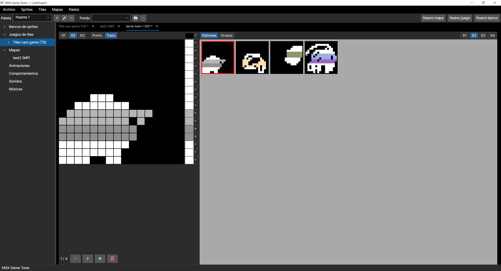
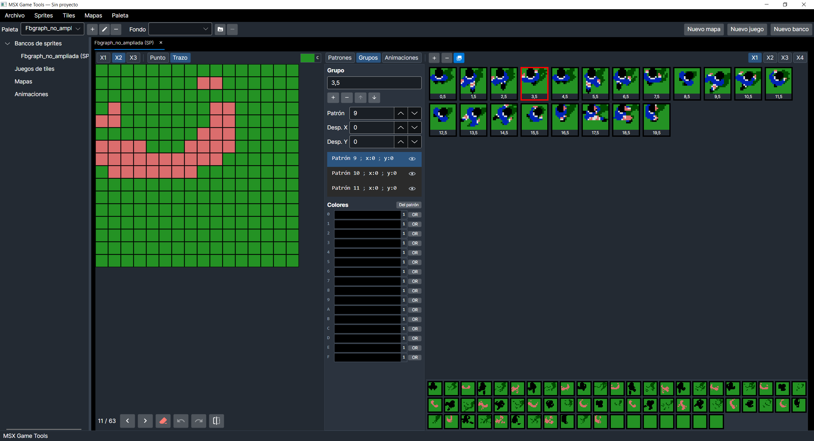
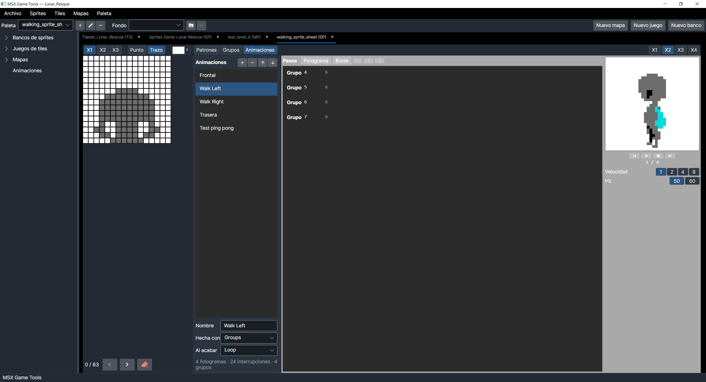
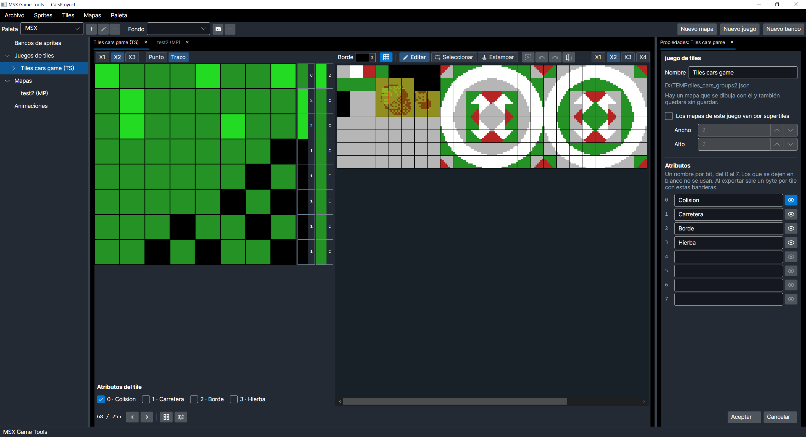
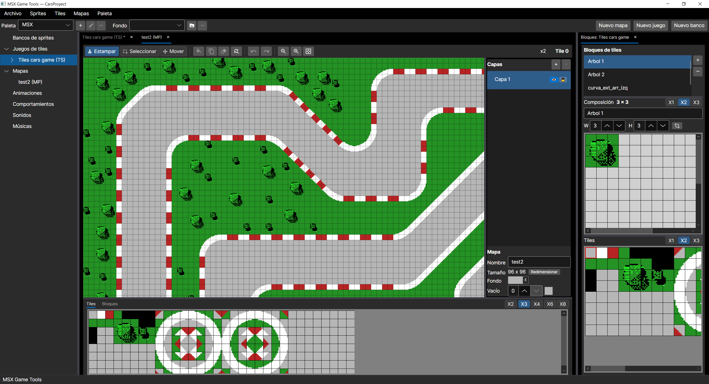

# MSX Game Tools

*[Read in English](README.md)*

Herramientas de creación de gráficos y mapas para juegos de MSX: sprites, juegos de
tiles, paletas, bloques y mapas, con exportación a los formatos que espera el VDP.

Escrito en C# sobre Avalonia 12.1 y .NET 10. Funciona en Windows, Linux y macOS.

## Cómo se ve

### Bancos de sprites

Los patrones de 16x16, con los dos colores de cada línea a la derecha del lienzo y el
banco entero arriba.



Y los **grupos**, que colocan varios patrones con desplazamiento para formar una figura
mayor de lo que da un plano. La columna `OR` marca las líneas que mezclan planos con el
bit CC del V9938, y a la derecha se ve el grupo compuesto.



Y las **animaciones**: los pasos a la izquierda del tablero, cada uno con qué enseña y
cuánto se queda, el reproductor a la derecha y, debajo del formulario, lo que le va a costar
a la máquina —fotogramas, interrupciones y grupos usados. Este andar son cuatro grupos en
bucle a 50 Hz.



### Juegos de tiles

El tile ampliado a la izquierda, los 256 en su rejilla de 32 columnas, y a la derecha las
propiedades del juego con sus **atributos**. El ojo de un atributo tiñe los tiles que ya
lo tienen puesto —aquí los dos marcados como colisión—, para verlos de golpe en vez de ir
abriéndolos uno a uno. Abajo del lienzo, las banderas del tile que se está editando.



### Mapas

El mapa con sus capas, los bloques del juego a la derecha —aquí un árbol de 3x3— y la
tira de tiles y bloques abajo para coger con qué pintar.



## Qué hace

### Bancos de sprites

- Sprites de 16x16 en dos variantes: MSX, con un color para todo el sprite, y MSX2, con
  un color por línea y el bit CC del V9938 para mezclar planos.
- **Grupos**: varios patrones colocados con desplazamiento para formar una figura mayor
  de lo que da un plano de sprite.
- **Animaciones**: secuencias de patrones o de grupos, cada fotograma con su espera, su
  desplazamiento y un número de aviso para que lo lea el juego. Bucles, anidados si hace
  falta, y un final de una vez, en bucle o ping-pong. Un reproductor las enseña a 50 o 60
  Hz, ralentizadas si se quiere.
- Imágenes de referencia detrás del lienzo, con opacidad regulable, para calcar.
- **Importa una hoja de sprites** desde un png: se marca un rectángulo y sale un banco con
  sus grupos, repartiendo cada color en el plano que le toca. Dice antes de importar
  cuántos planos hace falta y qué colores se estorban entre sí.
- Exporta la tabla de patrones, los atributos y las animaciones, en binario y en `.asm`,
  enteros o sólo los patrones que se digan. Los bucles salen como bucles: uno de doscientas
  vueltas no ocupa doscientas veces lo mismo en ROM.

### Juegos de tiles

- 256 tiles de 8x8 para GRAPHIC 2 y 3, con sus dos colores por línea.
- **Un solo juego, no tres.** El VDP parte la pantalla en tres tercios con su propia
  tabla cada uno; aquí se define uno y la exportación se replica, para que un tile se vea
  igual esté donde esté.
- Importa y exporta **png** para poder trabajar en GIMP o Photoshop. Al importar
  comprueba lo que la máquina no admite —más de dos colores en una línea de ocho
  píxeles— y dice en qué tile y en qué línea está el problema.
- **Bloques**: grupos de tiles de hasta 16x16 colocados como van a quedar en el mapa, un
  árbol de 3x3 o un supertile de 2x2. Sirven de brocha en el editor de mapas.
- **Atributos por tile**: ocho banderas con el nombre que se les quiera dar —sólido,
  escalera, agua— que salen en una tabla de un byte por tile, con sus máscaras como
  constantes `equ` para no traducir bits a mano. Son opcionales: mientras no se defina
  ninguno no aparecen por ninguna parte. Un ojo al lado de cada nombre tiñe en la rejilla
  los tiles que ya lo tienen puesto, para verlos de golpe.

### Mapas

- Tamaño libre hasta 1024 por lado, con **capas** que se aplastan al exportar.
- Estampar tiles sueltos, rectángulos de tiles o bloques enteros, con vista previa
  translúcida bajo el ratón.
- Seleccionar un rectángulo y rellenarlo, copiarlo o vaciarlo.
- Redimensionar con ancla, y sustituir rangos de tiles por otros.
- **Deshacer y rehacer**, veinte pasos.
- **Informe de desplazamiento**: saca del mapa la tabla que hace falta para el scroll suave
  de un pixel, dice en qué celdas se va a notar y lleva la vista a cada una.
- Entra y sale en json, csv (compatible con Tiled) y binario; y sale también en `.asm`.

### El programa

- En **español, inglés y catalán**, con cambio en caliente desde Preferencias, que también
  guarda con qué zoom arranca cada sitio. Los ajustes viven en la carpeta del usuario, no
  en el proyecto: compartir un proyecto no le cambia el idioma a nadie. Se quedan en
  español los mensajes de fichero mal formado, que son diagnóstico y sólo salen cuando
  algo está roto.
- **Escala de la interfaz** en Preferencias, del 100 al 200%, que agranda todo el programa
  por encima de lo que ya haga el sistema. El escalado por DPI funciona solo en Windows y
  macOS; esto es para trabajar al 100% en una pantalla densa, y en Linux con X11 —donde
  Avalonia se queda en factor 1 si el escritorio no pone `Xft.dpi`— puede ser la única
  salida sin tocar variables de entorno.
- Los menús van **por cosa** —Sprites, Tiles, Mapas, Paleta— igual que el árbol, así que lo
  que se exporta de tiles está al lado de lo que se importa de tiles.
- **Abrir** es uno solo: mira el fichero y sabe si es un banco, un juego, un mapa o una
  paleta. Y **Abrir reciente** guarda los diez últimos, sin repetidos, para no volver a
  buscarlos.
- **Aspecto** claro u oscuro, con variantes azuladas y anaranjadas de los dos.

### El proyecto y sus ficheros

- **Propiedades** en el nodo del árbol, o F2, para cambiarle el nombre a lo que sea. El
  fichero no se toca: cómo se llama un mapa es del mapa, y dónde vive lo decide quien lo
  guarda.

- **Guardar** escribe el documento que esté delante en el fichero del que salió, sea un
  banco, un juego de tiles o un mapa; sólo pregunta la ruta la primera vez.
- La pestaña de lo que está sin guardar lleva un asterisco, y al salir se avisa de lo que
  se perdería, con la opción de guardarlo antes.
- El **proyecto** (`.msxproj`) agrupa todo lo que hay abierto. Es un índice de rutas, no
  un fichero con todo dentro: cada juego, banco y mapa sigue en su `.json`, y a los que
  no tienen fichero todavía se les pone uno con su nombre junto al proyecto. Guardarlo
  guarda de una vez lo que se haya tocado, y abrirlo lo devuelve todo, cada mapa
  enganchado a su juego de tiles.

### Paletas

- Las quince del MSX1 más el índice transparente, y paletas propias para MSX2 con los
  512 colores del V9938.
- Cada juego de tiles y cada banco lleva la suya, y la guarda dentro de su fichero: los
  patrones son índices, no colores. Se elige al crearlo, en el mismo formulario que el
  nombre. Después, la barra de arriba enseña la del documento que esté delante, y elegir
  otra ahí se la cambia sólo a ése.
- Se exportan en el formato de dos bytes por color que espera el registro 16.

## Cómo se ejecuta

Clona con `git clone --recurse-submodules` (o ejecuta `git submodule update --init`
después): `tools/sass-MSX` es un submódulo con el ensamblador cruzado con el que se
montan las ROMs de prueba (`dotnet build tools/sass-MSX`, el mismo SDK que el
editor). El programa en sí no lo necesita.

```bash
dotnet run
```

Los tests:

```bash
dotnet test
```

## Decisiones que conviene conocer

Estas son las que más condicionan el código, y están explicadas con detalle en los
comentarios y en los mensajes de commit.

**El color 0 es transparente, en sprites y en tiles.** Deja ver el color del borde
(registro 7), no es un color más de la paleta. El editor lo pinta así para enseñar lo
que se va a ver en la máquina.

**La celda vacía no es el tile 0.** El tile 0 es un tile de verdad, así que bloques y
mapas distinguen «aquí no hay nada» de «aquí va el primero del juego». Al estampar, lo
vacío deja ver lo que hubiera debajo. En csv se escribe `-1`; en binario no cabe, porque
la tabla de nombres siempre dibuja algo, así que cada mapa lleva un tile de relleno.

**Las capas no existen en la máquina.** Son ayuda de edición: al exportar se funden en
una sola tabla de nombres, ganando la celda no vacía más alta.

**Un bloque y una capa son la misma estructura.** Un bloque es una tabla de nombres
pequeña y un mapa la misma tabla más grande, así que estampar un bloque en el mapa no
necesita ninguna traducción.

**El desplazamiento suave es un informe y no una comprobación.** El scroll de un pixel
guarda ocho copias del juego de tiles corridas una a una, y por cada tile hay que decidir
qué entra por su borde derecho: ceros, unos o la columna del tile siguiente. Lo dicta el
mapa, así que un tile puesto junto a vecinos distintos no tiene respuesta buena para todos.
Eso es la técnica, no un fallo del mapa: lo que hace falta saber es cuál es la opción
mayoritaria y cuántos sitios cuesta. Y se compara el **color** que se ve, no el bit: en
screen 1 el mismo azul puede ser la tinta de un tile y el papel de su vecino.

**Los tiles se enseñan siempre en 32 columnas.** Es la disposición del editor y la del
png, y la única en la que coger un rectángulo significa algo: un árbol dibujado en tres
filas sólo es un rectángulo si las filas miden lo que medían al dibujarlo.

**Los comentarios están en español.** Los nombres, el ensamblador que se exporta y el README
van en inglés; los comentarios explican el porqué de cada decisión, y hay unas 94.000
palabras escritas, así que se quedan como están. Los nuevos se escriben en inglés.

## Cómo se comprueba

Más de novecientas pruebas automáticas, que se ejecutan con la interfaz montada de verdad
(Avalonia headless con Skia) cuando lo que se prueba es la interfaz.

Dos costumbres que han salvado bastantes fallos:

- **Una prueba que no se ha visto fallar no vale.** Antes de dar por bueno un arreglo se
  vuelve a poner el fallo y se comprueba que la prueba cae. Y tiene que caer *por el
  camino que usa el usuario*: probar el ViewModel suelto ha dejado pasar más de un fallo
  que estaba en el punto de entrada.
- **Los exportadores se validan ensamblando de verdad.** El `.asm` que sale se pasa por
  el ensamblador cruzado sasSX y se compara byte a byte con el binario. Si los dos
  coinciden, el fichero sirve. sasSX está incluido como el submódulo `tools/sass-MSX`.

## ROMs de prueba

En `msx/test_rom` hay cuatro ROMs en ensamblador Z80 que cargan lo exportado y lo enseñan en
un MSX de verdad o en openMSX:

- `sprites_test.asm` — GRAPHIC 3 y sprites de modo 2, con los grupos colocados. Las
  teclas 0-F cambian el color del borde y F1 conmuta la magnificación.
- `tileset_test.asm` — GRAPHIC 2 con el juego de tiles replicado en los tres tercios.
- `map_test.asm` — un mapa pintado sobre su juego de tiles, con los cursores para moverse si
  es más grande que la pantalla. Lo que comprueba de verdad son los cuatro bytes de cabecera
  que escribe el exportador de mapas: los lee como los leería un juego y saca de ahí todo lo
  demás. El mapa de ejemplo es de 96x160 a propósito, para que su tabla cruce `8000H` y se
  ejercite la conmutación de página; y lleva un marco de tile 255, porque un borde torcido
  delata al instante que el ancho no es el que dice la cabecera.
- `supertile_test.asm` — lo mismo, sobre un mapa cuyas celdas son supertiles. Comprueba la
  tabla de supertiles, y con supertiles rectangulares a propósito: uno cuadrado disimularía
  un ancho y un alto intercambiados.

Las cuatro detectan en ejecución si están en un MSX1 o en un MSX2 para cargar la paleta sólo
donde se puede. Su README explica los mapas de VRAM y cómo cambiar entre datos incrustados
y ficheros propios.

## Estado

En desarrollo, y con el alcance ya decidido: esto es una suite de herramientas para hacer
juegos, no un generador de juegos. Funcionan los bancos de sprites con sus grupos y sus
**animaciones**, los juegos de tiles con sus bloques, las paletas, el editor de mapas y el
proyecto que los agrupa.

Lo que había apuntado de comportamientos, sonidos y música se ha retirado. Sacar la ROM de
un juego entero es otro programa, y mucho más difícil; un hueco vacío prometiéndolo sólo
envejece mal.

El formato de las animaciones está comprobado como el de todos los exportadores de aquí: se
ensambla el `.asm` con sass y se compara byte a byte con el binario. Queda la ROM de prueba
que lo lleve a openMSX, que es lo único que dice que la máquina lo lee como creemos.
