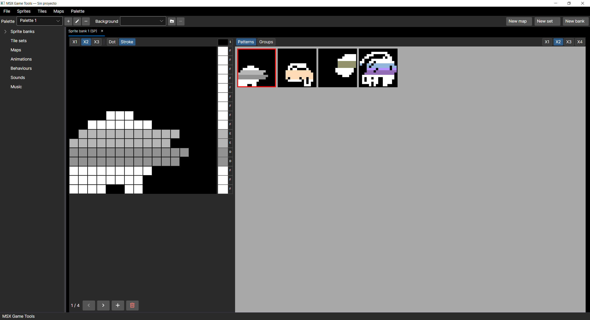
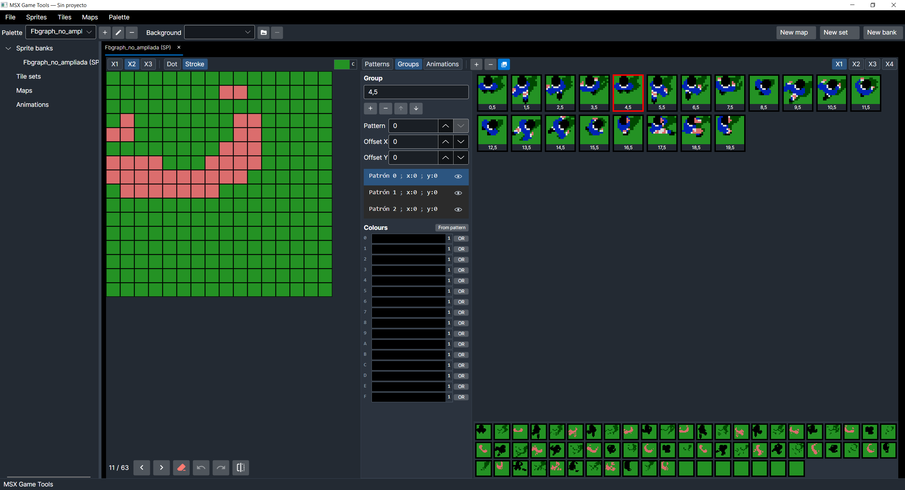
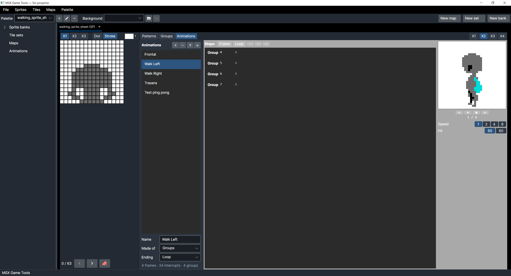
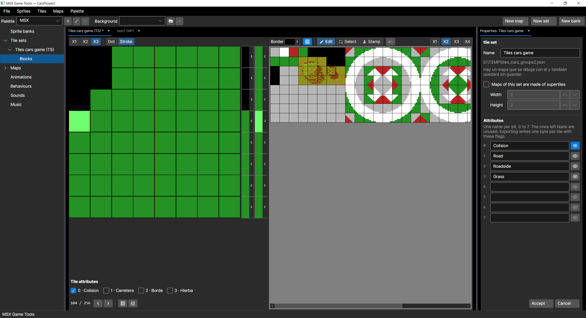
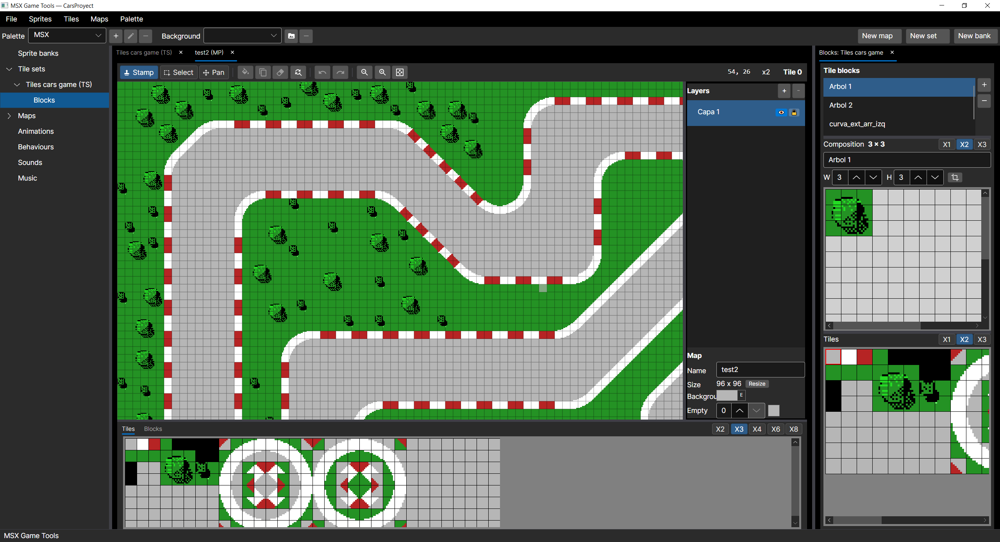

# MSX Game Tools

*[Leer en español](README.es.md)*

Graphics and map authoring tools for MSX games: sprites, tile sets, palettes, blocks and
maps, exporting to the formats the VDP expects.

Written in C# on Avalonia 12.1 and .NET 10. Runs on Windows, Linux and macOS.

## What it looks like

### Sprite banks

The 16x16 patterns, with each line's two colours down the right of the canvas and the
whole bank across the top.



And the **groups**, which place several patterns with offsets to build a figure bigger
than one plane allows. The `OR` column marks the lines that mix planes through the V9938
CC bit, and the composed group is shown on the right.



And the **animations**: the steps down the left of the board, each with what it shows and
how long it holds, the player on the right, and under the form what it is going to cost the
machine —frames, interrupts and groups used. This walk is four groups on a loop at 50 Hz.



### Tile sets

The tile magnified on the left, all 256 in their 32-column grid, and the set's properties
on the right with its **attributes**. An attribute's eye tints the tiles that already have
it set —here the two marked as collision— to spot them all at once instead of opening them
one by one. Under the canvas, the flags of the tile being edited.



### Maps

The map with its layers, the set's blocks on the right —a 3x3 tree here— and the strip of
tiles and blocks along the bottom to pick what to paint with.



## What it does

### Sprite banks

- 16x16 sprites in two flavours: MSX, with one colour for the whole sprite, and MSX2,
  with a colour per line and the V9938 CC bit for overlapping planes.
- **Groups**: several patterns placed with offsets to build a figure bigger than a single
  sprite plane allows.
- **Animations**: sequences of patterns or of groups, each frame with its wait, its offset
  and an event number for the game to read. Loops, nested if need be, and an ending of
  once, loop or ping-pong. A player shows them at 50 or 60 Hz, slowed down if you want.
- Reference images behind the canvas, with adjustable opacity, for tracing.
- **Imports a sprite sheet** from a png: mark a rectangle and out comes a bank with its
  groups, each colour dealt into the plane it belongs to. Before importing it says how many
  planes are needed and which colours get in each other's way.
- Exports the pattern table, the attributes and the animations, as binary and as `.asm`,
  whole or only the patterns you name. Loops are exported as loops: one of two hundred
  turns does not take two hundred times the room in ROM.

### Tile sets

- 256 tiles of 8x8 for GRAPHIC 2 and 3, with their two colours per line.
- **One set, not three.** The VDP splits the screen into three thirds, each with its own
  tables; here you define one set and the export replicates it, so a tile looks the same
  wherever the map puts it.
- Imports and exports **png**, so the work can move to GIMP or Photoshop. On import it
  checks what the machine cannot do —more than two colours in a line of eight pixels—
  and says which tile and which line is at fault.
- **Blocks**: groups of tiles up to 16x16, arranged as they will look on the map: a 3x3
  tree, or a 2x2 supertile. They work as brushes in the map editor.
- **Per-tile attributes**: eight flags with whatever names you give them —solid, ladder,
  water— exported as a one-byte-per-tile table, with their masks as `equ` constants so
  nobody has to translate bits by hand. They are optional: until one is named, they show
  up nowhere. An eye next to each name tints the tiles that already have it set, to see
  them all at once.

### Maps

- Any size up to 1024 per side, with **layers** that are flattened on export.
- Stamp single tiles, rectangles of tiles or whole blocks, with a translucent preview
  under the pointer.
- Select a rectangle and fill it, copy it or clear it.
- Resize with an anchor, and replace ranges of tiles with others.
- **Undo and redo**, twenty steps.
- **Shift report**: derives from the map the table needed for one-pixel smooth scrolling,
  says in which cells it will show, and takes the view to each one.
- Reads and writes json, csv (Tiled compatible) and binary; also writes `.asm`.

### The application

- In **Spanish, English and Catalan**, switched live from Preferences, which also stores
  the zoom each area starts at. Settings live in the user's folder, not in the project:
  sharing a project does not change anybody's language. Malformed-file messages stay in
  Spanish: they are diagnostics and only show up when something is broken.
- **Interface scale** in Preferences, from 100 to 200%, making the whole application bigger
  on top of whatever the system already does. DPI scaling works on its own on Windows and
  macOS; this is for working at 100% on a dense screen, and on Linux with X11 — where
  Avalonia stays at factor 1 unless the desktop sets `Xft.dpi` — it may be the only way out
  short of environment variables.
- Menus are grouped **by thing** — Sprites, Tiles, Maps, Palette — like the tree, so what
  you export from tiles sits next to what you import into tiles.
- **Open** is a single entry: it looks at the file and knows whether it is a bank, a set, a
  map or a palette. And **Open recent** keeps the last ten, without repeats, so they need
  not be hunted down again.
- **Appearance** light or dark, with blue and orange variants of both.

### The project and its files

- **Properties** on the tree node, or F2, to rename anything. The file is left alone: what
  a map is called belongs to the map, and where it lives is decided by whoever saves it.

- **Save** writes whatever document is in front — a bank, a tile set or a map — back to
  the file it came from, and only asks for a path the first time.
- Tabs with unsaved work carry an asterisk, and quitting warns about what would be lost,
  offering to save it first.
- The **project** (`.msxproj`) groups everything that is open. It is an index of paths,
  not a file with everything inside: each set, bank and map stays in its own `.json`, and
  anything without a file yet gets one named after it, next to the project. Saving it
  writes whatever has been touched in one go, and opening it brings it all back, each map
  attached to its tile set.

### Palettes

- The fifteen MSX1 colours plus the transparent index, and custom MSX2 palettes from the
  512 colours of the V9938.
- Every tile set and every sprite bank carries its own, stored inside its file: patterns
  are indices, not colours. It is chosen when you create it, in the same form as the name.
  After that, the bar at the top shows the palette of whichever document is in front, and
  picking another there changes that one only.
- Exported in the two-bytes-per-colour format that register 16 expects.

## Running it

Clone with `git clone --recurse-submodules` (or run `git submodule update --init`
afterwards): `tools/sass-MSX` is a submodule with the cross-assembler the test
ROMs are built with (`dotnet build tools/sass-MSX`, same SDK as the editor). The
application itself does not need it.

```bash
dotnet run
```

The tests:

```bash
dotnet test
```

## Decisions worth knowing

These shape the code the most. They are explained in detail in the comments and in the
commit messages.

**Colour 0 is transparent, in sprites and in tiles.** It shows the border colour
(register 7); it is not just another palette entry. The editor draws it that way so you
see what the machine will show.

**An empty cell is not tile 0.** Tile 0 is a real tile, so blocks and maps tell "nothing
here" apart from "the first tile of the set". When stamping, an empty cell lets whatever
is underneath show through. In csv it is written as `-1`; in binary there is no room for
it, because the name table always draws something, so every map carries a filler tile.

**Layers do not exist on the machine.** They are an authoring aid: on export they are
merged into a single name table, the topmost non-empty cell winning.

**A block and a layer are the same structure.** A block is a small name table and a map
is the same table, bigger, so stamping a block onto a map needs no translation.

**Smooth scrolling is a report, not a check.** One-pixel scrolling keeps eight copies of the
tile set, each shifted one more pixel, and for every tile something has to enter from the
right: zeros, ones or the next tile's column. The map dictates which, so a tile placed next
to different neighbours has no answer that is good for all of them. That is the technique,
not a fault in the map: what you need to know is the majority option and how many places it
costs. And it compares the **colour** you see, not the bit: in screen 1 the same blue can be
one tile's ink and its neighbour's paper.

**Tiles are always shown in 32 columns.** That is the layout of the editor and of the
png, and the only one where picking a rectangle means anything: a tree drawn across three
rows is only a rectangle if the rows are as wide as they were when it was drawn.

**The comments are in Spanish.** The names, the assembly that is exported and this README
are in English; the comments explain the *why* behind each decision, and there are some
94,000 words of them, so they stay as they were written. New ones are written in English.

## How it is checked

Over nine hundred automated tests, run with the interface actually mounted (Avalonia
headless with Skia) whenever the interface is what is under test.

Two habits that have caught a fair number of bugs:

- **A test you have not seen fail is worth nothing.** Before accepting a fix, the bug is
  put back to check that the test falls. And it has to fall *through the path the user
  takes*: testing the ViewModel on its own has let more than one bug through that lived
  in the entry point.
- **Exporters are validated by actually assembling.** The `.asm` produced is run through
  the sasSX cross-assembler and compared byte for byte against the binary. If the two
  match, the file is good. sasSX is vendored as the `tools/sass-MSX` submodule: the tests
  take it from its build output (`dotnet build tools/sass-MSX -c Release`, `Release` before
  `Debug`) or from the `PATH`, and `SASSX` names another one. Without it that check is
  skipped and says so.

## Test ROMs

`msx/test_rom` holds three Z80 assembly ROMs that load the exported data and show it on a
real MSX or on openMSX:

- `sprites_test.asm` — GRAPHIC 3 and sprite mode 2, with the groups laid out. Keys 0-F
  change the border colour and F1 toggles magnification.
- `map_test.asm` — a map painted over its tile set, with the cursor keys to move around
  one that is bigger than the screen. What it really checks is the four header bytes the
  map exporter writes: it reads them the way a game would and works everything out from
  them. The sample map is 96x160 on purpose, so its table crosses `8000H` and the page
  switching gets exercised; and it carries a frame of tile 255, because a border that comes
  out crooked says the width is wrong at a glance.
- `supertile_test.asm` — the same, over a map whose cells are supertiles. It checks the
  supertile table, with rectangular supertiles on purpose: a square one hides a swapped
  width and height.

The one for a tile set is not in there because **the editor writes it**: exporting a tile
set can bring an example ROM with it, filled in for the assembler you pick —sasSX,
sjasmplus, pasmo or asMSX—, for the screen mode of the set, and naming the files you have
just exported. The one for a sprite bank is generated too, with the animation player
beside it, for MSX2 banks.

All of them detect at runtime whether they are on an MSX1 or an MSX2, so the palette is
only loaded where it can be. That folder's README explains the VRAM maps and how to switch
between embedded data and your own files.

## Status

Under development, with the scope already settled: this is a suite of tools for making
games, not a game maker. Sprite banks with their groups and their **animations**, tile sets
with their blocks, palettes, the map editor and the project that groups them all work.

What had been pencilled in for behaviours, sounds and music has been dropped. Producing a
whole game's ROM is a different program, and a far harder one; an empty slot promising it
only ages badly.

The animation format is checked the way every exporter here is: the `.asm` is assembled
with sass and compared byte for byte against the binary. What is left is the test ROM that
takes it to openMSX, which is the only thing that says the machine reads it as we think.
